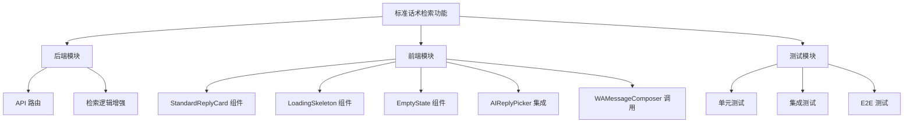
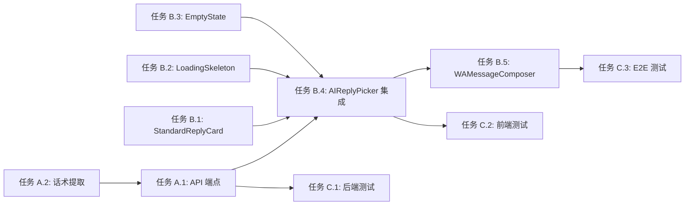

# 功能规划：标准话术检索（第三选项）

**规划时间**：2026-04-20  
**预估工作量**：18 任务点

---

## 1. 功能概述

### 1.1 目标
在现有的 AI 回复生成界面中，新增第三个选项「标准话术」，通过纯检索方式从规则文档中匹配最相关的标准话术，**不经过 AI 模型生成**，提供快速、可靠的标准回复。

### 1.2 范围

**包含**：
- 新增后端 API：`POST /api/experience/retrieve-template`
- 前端新增 3 个组件：`StandardReplyCard`、`LoadingSkeleton`、`EmptyState`
- 修改 `AIReplyPicker` 组件，集成第三个选项
- 修改 `WAMessageComposer` 调用逻辑，并行加载标准话术和 AI 生成
- 琥珀色系视觉区分（amber）

**不包含**：
- AI 模型训练或微调
- 向量数据库集成（使用现有的关键词匹配）
- 话术编辑功能（Phase 2）

### 1.3 技术约束
- 数据源：`docs/rag/sources/` 下的 6 个知识源
- 检索服务：复用 `localRuleRetrievalService.js`
- 响应时间：< 500ms（纯文件读取，无 AI 调用）
- 技术栈：Node.js/Express + React
- 兼容性：桌面 + 移动端响应式

---

## 2. WBS 任务分解

### 2.1 分解结构图



### 2.2 任务清单

#### 模块 A：后端 API（5 任务点）

**文件**: `server/routes/experience.js`

- [ ] **任务 A.1**：新增 `POST /api/experience/retrieve-template` 端点（3 点）
  - **输入**：`{ client_id, operator, scene, user_message }`
  - **输出**：`{ templates: [{ id, title, content, source, score }], metadata: { ... } }`
  - **关键步骤**：
    1. 调用 `retrieveLocalRules({ scene, operator, userMessage, maxSources: 3 })`
    2. 对每个匹配的 source，调用 `loadSourceContent(source)`
    3. 提取话术段落（按 `##` 或 `###` 分段）
    4. 返回格式化的 templates 数组
    5. 添加错误处理和日志

- [ ] **任务 A.2**：增强 `localRuleRetrievalService.js` 的话术提取（2 点）
  - **输入**：知识源 Markdown 内容
  - **输出**：结构化话术列表
  - **关键步骤**：
    1. 新增 `extractTemplatesFromSource(content, sourceId)` 函数
    2. 按 Markdown 标题分段（`## Script A`, `### Subject Pool`）
    3. 过滤掉元数据部分（`## Scope`, `## SOP Flow`）
    4. 返回 `{ title, content, section }` 数组

---

#### 模块 B：前端组件（8 任务点）

**文件**: `src/components/StandardReplyCard.jsx`

- [ ] **任务 B.1**：创建 `StandardReplyCard` 组件（2 点）
  - **输入**：`{ template, onEdit, onSend, compactMobile }`
  - **输出**：琥珀色系卡片 UI
  - **关键步骤**：
    1. 使用 `#f59e0b`（amber-500）作为主色调
    2. 显示话术来源标签（`source.title`）
    3. 显示话术内容（最大高度 120px，可滚动）
    4. 底部「编辑」和「使用」按钮
    5. 响应式适配（移动端宽度 88%）

**文件**: `src/components/LoadingSkeleton.jsx`

- [ ] **任务 B.2**：创建 `LoadingSkeleton` 组件（1 点）
  - **输入**：`{ compactMobile }`
  - **输出**：骨架屏动画
  - **关键步骤**：
    1. 使用 `animate-pulse` 实现闪烁效果
    2. 模拟卡片布局（标题 + 内容区域）
    3. 琥珀色系背景（`rgba(245,158,11,0.08)`）

**文件**: `src/components/EmptyState.jsx`

- [ ] **任务 B.3**：创建 `EmptyState` 组件（1 点）
  - **输入**：`{ onRetry, message }`
  - **输出**：空状态提示 UI
  - **关键步骤**：
    1. 显示友好提示文案：「暂无匹配的标准话术」
    2. 提供「重试」按钮
    3. 提供「使用 AI 生成」引导

**文件**: `src/components/AIReplyPicker.jsx`

- [ ] **任务 B.4**：集成第三个选项到 `AIReplyPicker`（3 点）
  - **输入**：新增 props `{ standardTemplate, standardLoading, standardError, onSelectStandard }`
  - **输出**：3 列布局（桌面）/ 3 卡片横滑（移动）
  - **关键步骤**：
    1. 修改 `overflow-x-auto` 容器，支持 3 个卡片
    2. 在 `CandidateCard B` 后插入 `StandardReplyCard`
    3. 处理 `standardLoading` 状态（显示 `LoadingSkeleton`）
    4. 处理 `standardError` 状态（显示 `EmptyState`）
    5. 调整卡片宽度（桌面 48% → 移动 88%）

**文件**: `src/components/WAMessageComposer.jsx`

- [ ] **任务 B.5**：修改 `WAMessageComposer` 调用逻辑（1 点）
  - **输入**：现有 AI 生成流程
  - **输出**：并行加载标准话术和 AI 生成
  - **关键步骤**：
    1. 新增 state：`standardTemplate`, `standardLoading`, `standardError`
    2. 在 `handleGenerateAI` 中并行调用 `fetchStandardTemplate()`
    3. 传递新 props 到 `AIReplyPicker`
    4. 处理「使用标准话术」回调

---

#### 模块 C：测试（5 任务点）

**文件**: `server/routes/__tests__/experience.test.js`

- [ ] **任务 C.1**：后端 API 单元测试（2 点）
  - **输入**：测试用例
  - **输出**：覆盖率 ≥ 80%
  - **关键步骤**：
    1. 测试正常检索流程（返回 templates）
    2. 测试无匹配场景（返回空数组）
    3. 测试错误处理（知识源文件不存在）
    4. 测试参数验证（缺少 client_id）

**文件**: `src/components/__tests__/StandardReplyCard.test.jsx`

- [ ] **任务 C.2**：前端组件单元测试（2 点）
  - **输入**：测试用例
  - **输出**：覆盖率 ≥ 80%
  - **关键步骤**：
    1. 测试 `StandardReplyCard` 渲染
    2. 测试 `LoadingSkeleton` 动画
    3. 测试 `EmptyState` 交互
    4. 测试 `AIReplyPicker` 3 列布局

**文件**: `cypress/e2e/standard-reply.cy.js`

- [ ] **任务 C.3**：E2E 测试（1 点）
  - **输入**：关键用户流程
  - **输出**：端到端验证
  - **关键步骤**：
    1. 打开消息编辑器
    2. 点击「生成回复」
    3. 验证标准话术卡片出现
    4. 点击「使用」按钮
    5. 验证话术填充到编辑器

---

## 3. 依赖关系

### 3.1 依赖图



### 3.2 依赖说明

| 任务 | 依赖于 | 原因 |
|------|--------|------|
| B.4 | A.1, B.1, B.2, B.3 | 需要 API 和子组件完成后才能集成 |
| B.5 | B.4 | 需要 AIReplyPicker 支持第三选项 |
| C.3 | B.5 | 需要完整流程实现后才能 E2E 测试 |
| C.1 | A.1 | 需要 API 实现后才能测试 |
| C.2 | B.4 | 需要组件实现后才能测试 |

### 3.3 并行任务

以下任务可以并行开发：
- 任务 A.2 ∥ 任务 B.1 ∥ 任务 B.2 ∥ 任务 B.3
- 任务 C.1 ∥ 任务 C.2

---

## 4. 实施建议

### 4.1 技术选型

| 需求 | 推荐方案 | 理由 |
|------|----------|------|
| 话术提取 | Markdown 正则解析 | 知识源已是结构化 Markdown，无需复杂解析器 |
| 视觉区分 | Tailwind amber 色系 | 与现有 AI 生成（蓝/紫）形成对比 |
| 并行加载 | Promise.all | 标准话术和 AI 生成互不依赖 |
| 响应式布局 | Flexbox + snap-scroll | 与现有 AIReplyPicker 保持一致 |

### 4.2 潜在风险

| 风险 | 影响 | 缓解措施 |
|------|------|----------|
| 知识源文件缺失 | 高 | API 返回空数组 + 友好提示，不阻断 AI 生成 |
| 话术过长导致 UI 溢出 | 中 | 设置 `max-height: 120px` + 滚动条 |
| 移动端 3 卡片横滑性能 | 低 | 使用 CSS `snap-scroll`，无 JS 滚动监听 |
| 检索结果不相关 | 中 | Phase 2 引入用户反馈机制（点赞/点踩） |

### 4.3 测试策略

- **单元测试**：
  - 后端：`retrieveLocalRules` 匹配逻辑
  - 前端：`StandardReplyCard` 渲染和交互
- **集成测试**：
  - API 端点完整流程（请求 → 检索 → 返回）
- **E2E 测试**：
  - 用户点击「生成回复」→ 看到 3 个选项 → 点击「使用标准话术」→ 话术填充到编辑器

---

## 5. 验收标准

功能完成需满足以下条件：

- [ ] 用户在回复界面看到 3 个选项：「方案一」「方案二」「标准话术」
- [ ] 标准话术卡片使用琥珀色系（amber），与 AI 生成视觉区分
- [ ] 标准话术显示来源标签（如「Trial Package Policy」）
- [ ] 点击「使用」后，话术填充到编辑器
- [ ] 无匹配时显示「暂无匹配的标准话术」+ 重试按钮
- [ ] 标准话术加载时间 < 500ms（先于 AI 生成显示）
- [ ] 移动端 3 卡片横滑流畅，无卡顿
- [ ] 单元测试覆盖率 ≥ 80%
- [ ] E2E 测试通过关键用户流程
- [ ] 代码审查通过（无 SQL 注入、XSS 风险）

---

## 6. 实施步骤（按优先级）

### Phase 1：核心功能（12 任务点）
1. **任务 A.2**：增强话术提取逻辑（2 点）
2. **任务 A.1**：实现 API 端点（3 点）
3. **任务 B.1, B.2, B.3**：创建前端子组件（4 点）
4. **任务 B.4**：集成到 AIReplyPicker（3 点）

### Phase 2：集成和测试（6 任务点）
5. **任务 B.5**：修改 WAMessageComposer（1 点）
6. **任务 C.1, C.2**：单元测试（4 点）
7. **任务 C.3**：E2E 测试（1 点）

---

## 7. 后续优化方向（Phase 2）

- **用户反馈机制**：点赞/点踩标准话术，优化检索算法
- **话术编辑**：允许用户在使用前微调标准话术
- **多语言支持**：自动检测用户语言，返回对应语言的话术
- **话术版本管理**：支持话术 A/B 测试和版本回滚
- **向量检索**：引入 embedding 提升语义匹配精度

---

## 8. 关键代码片段

### 8.1 后端 API 端点

```javascript
// server/routes/experience.js
router.post('/retrieve-template', async (req, res) => {
    try {
        const { client_id, operator, scene, user_message } = req.body;

        // 调用检索服务
        const sources = retrieveLocalRules({
            scene,
            operator,
            userMessage: user_message,
            maxSources: 3
        });

        // 提取话术
        const templates = [];
        for (const source of sources) {
            const content = loadSourceContent(source);
            if (!content) continue;

            const extracted = extractTemplatesFromSource(content, source.id);
            templates.push(...extracted.map(t => ({
                ...t,
                source: { id: source.id, title: source.title },
                score: source.score
            })));
        }

        res.json({
            templates: templates.slice(0, 5), // 最多返回 5 个
            metadata: {
                sources: sources.map(s => ({ id: s.id, title: s.title, score: s.score })),
                retrieved_at: new Date().toISOString()
            }
        });
    } catch (error) {
        console.error('[retrieve-template] Error:', error);
        res.status(500).json({ error: 'Failed to retrieve templates' });
    }
});
```

### 8.2 前端 StandardReplyCard 组件

```jsx
// src/components/StandardReplyCard.jsx
export default function StandardReplyCard({ template, onEdit, onSend, compactMobile }) {
    return (
        <div
            className="shrink-0 snap-start rounded-[18px] px-3 py-3"
            style={{
                width: compactMobile ? '88%' : '48%',
                minWidth: compactMobile ? '280px' : '320px',
                background: 'rgba(245,158,11,0.08)',
                border: '1px solid rgba(245,158,11,0.24)',
            }}
        >
            <div className="flex items-center gap-2 mb-2">
                <span className="text-[11px] font-bold px-2 py-0.5 rounded-full"
                    style={{ background: '#f59e0b', color: '#fff' }}>
                    标准
                </span>
                <span className="text-[10px]" style={{ color: '#78716c' }}>
                    {template.source.title}
                </span>
            </div>
            <div className="text-sm leading-relaxed overflow-y-auto" style={{ maxHeight: '120px' }}>
                {template.content}
            </div>
            <div className="mt-3 flex gap-2">
                <button onClick={onEdit} className="flex-1 px-3 py-2 rounded-full text-[12px] font-semibold"
                    style={{ background: '#fff', color: '#78716c', border: '1px solid #e7e5e4' }}>
                    编辑
                </button>
                <button onClick={onSend} className="flex-1 px-3 py-2 rounded-full text-[12px] font-semibold text-white"
                    style={{ background: '#f59e0b' }}>
                    使用
                </button>
            </div>
        </div>
    );
}
```

---

## 9. 文件清单

### 新增文件
- `src/components/StandardReplyCard.jsx`
- `src/components/LoadingSkeleton.jsx`
- `src/components/EmptyState.jsx`
- `server/routes/__tests__/experience.test.js`
- `src/components/__tests__/StandardReplyCard.test.jsx`
- `cypress/e2e/standard-reply.cy.js`

### 修改文件
- `server/routes/experience.js` - 新增 `/retrieve-template` 端点
- `server/services/localRuleRetrievalService.js` - 新增 `extractTemplatesFromSource` 函数
- `src/components/AIReplyPicker.jsx` - 集成第三个选项
- `src/components/WAMessageComposer.jsx` - 并行加载标准话术

---

**规划完成。预估总工作量：18 任务点（约 18-36 小时）**
